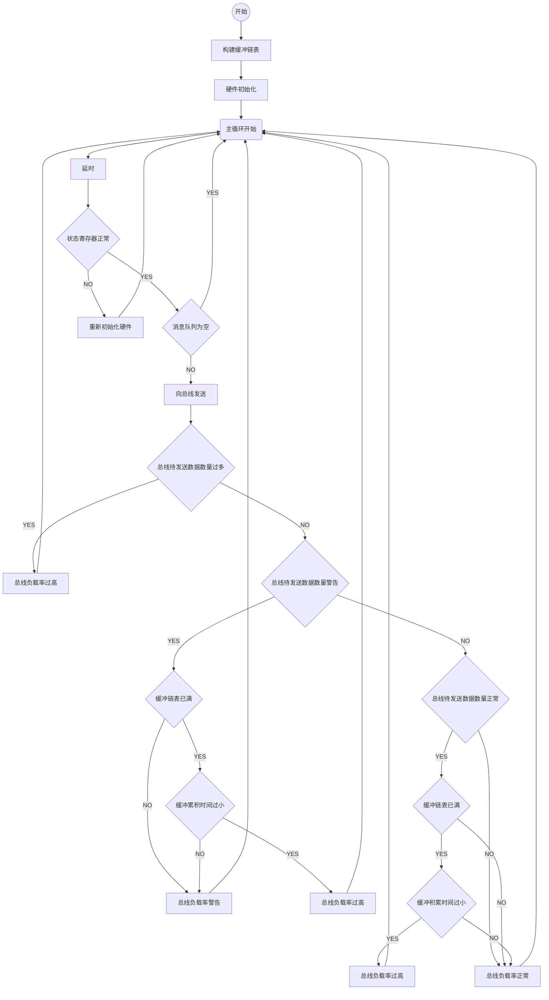
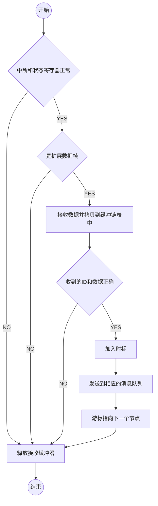

# t_can()

```c
void                 /* 无返回值 */
t_can(               /* CAN通信任务 */
        int addr,    /* CAN总线基地址表 */
        int irq,     /* CAN总线中断号表 */
        int n,       /* CAN总线数量 */
        int period,  /* 任务运行周期 */
        int duration /* CAN总线接收缓冲链表长度 */
)
```


# isr_rx_can0()
# isr_rx_can1()

```c
static void      /* 无返回值 */
isr_rx_can0(     /* CAN总线0接收中断服务程序 */
        int addr /* CAN总线0基地址 */
);

static void      /* 无返回值 */
isr_rx_can1(     /* CAN总线1接收中断服务程序 */
        int addr /* CAN总线1基地址 */
);
```



# init_can()

```c
static void        /* 无返回值 */
init_can(
        int *addr, /* CAN总线基地址表 */
        int *irq,  /* CAN总线中断号表 */
        int cable  /* 总线编号 */
)
```
