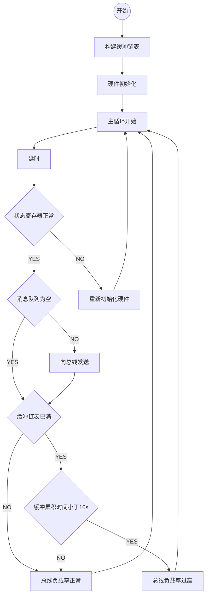
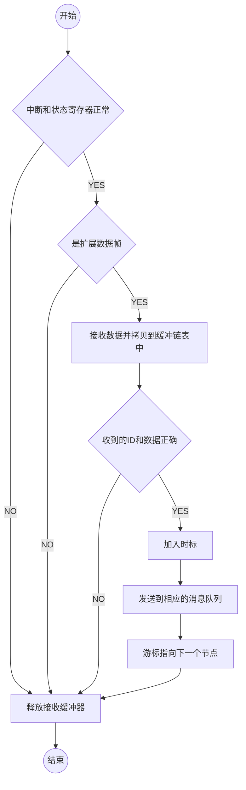

# 全局变量
| 序号 | 变量名 | 说明 |
| :-: | :-: | :- |
| 1 | p_can | CAN总线接收缓冲链表游标 |

# 函数定义

## void t_can(int period, int duration) {}

### 局部变量定义
| 序号 | 变量名 | 说明 |
| :-: | :-: | :- |
| 1 | recv | 数据来源的任务ID和接收数据的首地址 |
| 2 | i | 循环变量 |
| 3 | id | 中间变量存储ID（29位ID左对齐） |
| 4 | buf | CAN总线缓存数据及存储数量 |
| 5 | lst | 定义链表头 |
| 6 | delta | 链表缓冲累积时间差 |

### 函数调用
| 序号 | 函数名 | 说明 |
| :-: | :-: | :- |
| 1 | lstInit | _库函数：初始化链表_ |
| 2 | lstAdd | _库函数：向链表添加节点_ |
| 3 | lstFirst | _库函数：找到链表首节点地址_ |
| 4 | lstLast | _库函数：找到链表尾节点地址_ |
| 5 | init_can0 | 初始化CAN0总线 |
| 6 | init_can1 | 初始化CAN1总线 |
| 7 | taskDelay | _库函数：延时_ |
| 8 | msgQReceive | _库函数：接收消息队列_ |
| 9 | lstPrevious | _库函数：找到前一个节点_ |
| 10 | taskSuspend | _库函数：任务挂起_ |

## void isr_rx_can0(void) {} / ## void isr_rx_can1(void) {}

### 局部变量定义

| 序号 | 变量名 | 说明 |
| :-: | :-: | :- |
| 1 | send | 自身的任务ID和发送数据的首地址 |

### 函数调用
| 序号 | 函数名 | 说明 |
| :-: | :-: | :- |
| 1 | tickGet | _库函数：获取内核时钟计数值_ |
| 2 | msgQSend | _库函数：发送消息队列_ |
| 3 | lstNext | _库函数：找到下一个节点地址_ |

## void init_can0(void) {} / void init_can1(void) {}

### 函数调用
| 序号 | 函数名 | 说明 |
| :-: | :-: | :- |
| 1 | sysIntDisablePIC | _库函数：系统中断失能_ |
| 2 | intConnect | _库函数：中断绑定_ |
| 3 | sysIntEnablePIC | _库函数：系统中断使能_ |
