# t_core()

```c
void                /* 无返回值 */
t_core(             /* 主任务 */
        int period  /* 任务运行周期 */
)
```

```mermaid
graph TB
        开始((开始))-->四支腿上电
        四支腿上电-->四支腿时标[获取系统时标]
        四支腿时标-->启动横展+俯仰+垂直任务
        启动横展+俯仰+垂直任务-->等待横展+俯仰+垂直任务自检判定结果
        等待横展+俯仰+垂直任务自检判定结果-->挂起横展+俯仰+垂直任务横展任务
        挂起横展+俯仰+垂直任务横展任务-->四支腿小于50ms{等待时间小于50ms}
        四支腿小于50ms--YES-->四支腿补偿[补偿延时50ms]
        四支腿小于50ms--NO-->四支腿断电
        四支腿补偿-->四支腿断电
        四支腿断电-->四支腿延时[延时50ms]
        四支腿延时-->前后三轴转载机构上电
        前后三轴转载机构上电-->三轴时标[获取系统时标]
        三轴时标-->启动三轴转载机构任务
        启动三轴转载机构任务-->等待三轴转载机构任务自检判定结果
        等待三轴转载机构任务自检判定结果-->挂起三轴转载机构任务
        挂起三轴转载机构任务-->三轴小于50ms{等待时间小于50ms}
        三轴小于50ms--YES-->三轴补偿[补偿延时50ms]
        三轴小于50ms--NO-->前后三轴转载机构断电
        三轴补偿-->前后三轴转载机构断电
        前后三轴转载机构断电-->三轴延时[延时50ms]
        三轴延时-->防护棚上电
        防护棚上电-->防护棚时标[获取系统时标]
        防护棚时标-->启动防护棚任务
        启动防护棚任务-->等待防护棚任务自检判定结果
        等待防护棚任务自检判定结果-->挂起防护棚任务
        挂起防护棚任务-->防护棚小于50ms{等待时间小于50ms}
        防护棚小于50ms--YES-->防护棚补偿[补偿延时50ms]
        防护棚小于50ms--NO-->防护棚断电
        防护棚补偿-->防护棚断电
        防护棚断电-->防护棚延时[延时50ms]
        防护棚延时-->恒力矩上电
        恒力矩上电-->恒力矩+顶升时标[获取系统时标]
        恒力矩+顶升时标-->启动恒力矩+顶升任务
        启动恒力矩+顶升任务-->等待恒力矩+顶升任务自检判定结果
        等待恒力矩+顶升任务自检判定结果-->挂起恒力矩+顶升任务
        挂起恒力矩+顶升任务-->恒力矩+顶升小于50ms{等待时间小于50ms}
        恒力矩+顶升小于50ms--YES-->恒力矩+顶升补偿[补偿延时50ms]
        恒力矩+顶升小于50ms--NO-->恒力矩断电
        恒力矩+顶升补偿-->恒力矩断电
        恒力矩断电-->恒力矩+顶升延时[延时50ms]
        恒力矩+顶升延时-->启动视觉定位任务
        启动视觉定位任务-->等待视觉定位自检判定结果
        等待视觉定位自检判定结果-->挂起视觉定位任务
        挂起视觉定位任务-->开机自检完成
        开机自检完成-->结束((结束))
```



# 函数定义

## void t_core(int period) {}

### 局部变量定义
| 序号 | 变量名 | 说明 |
| :-: | :-: | :- |
| 1 | recv | 接收任务ID和各子任务地址 |
| 2 | send | 发送任务ID和各子任务地址 |
| 3 | swh0 | 左前横展 |
| 4 | swh1 | 左后横展 |
| 5 | swh2 | 右后横展 |
| 6 | swh3 | 右前横展 |
| 7 | swv0 | 左前俯仰 |
| 8 | swv1 | 左后俯仰 |
| 9 | swv2 | 右后俯仰 |
| 10 | swv3 | 右前俯仰 |
| 11 | prp0 | 左前垂直 |
| 12 | prp1 | 左后垂直 |
| 13 | prp2 | 右后垂直 |
| 14 | prp3 | 右前垂直 |
| 15 | x0 | 前纵移 |
| 16 | x1 | 后纵移 |
| 17 | y0 | 前外横移 |
| 18 | y1 | 前内横移 |
| 19 | y2 | 后内横移 |
| 20 | y3 | 后外横移 |
| 21 | z0 | 前卷杨 |
| 22 | z1 | 后卷杨 |
| 23 | shdf0 | 左前外端帘 |
| 24 | shdf1 | 左前内端帘 |
| 25 | shdf2 | 右前内端帘 |
| 26 | shdf3 | 右前外端帘 |
| 27 | shdb0 | 左后外端帘 |
| 28 | shdb1 | 左后内端帘 |
| 29 | shdb2 | 右后内端帘 |
| 30 | shdb3 | 右后外端帘 |
| 31 | shds0 | 左前侧帘 |
| 32 | shds1 | 左后侧帘 |
| 33 | shds2 | 右后侧帘 |
| 34 | shds3 | 右前侧帘 |
| 35 | shdt | 纵展 |
| 36 | mom0 | 左前恒力矩 |
| 37 | mom1 | 左后恒力矩 |
| 38 | mom2 | 右后恒力矩 |
| 39 | mom3 | 右前恒力矩 |

###函数调用
| 序号 | 函数名 | 说明 |
| :-: | :-: | :- |
| 1 | taskIdSelf | _库函数：得到调用任务的ID_ |
| 2 | taskResume | _库函数：恢复任务_ |
| 3 | taskSuspend | _库函数：任务挂起_ |
| 4 | memset | _库函数：内存空间初始化_ |
| 5 | msgQSend | _库函数：发送消息队列_ |
