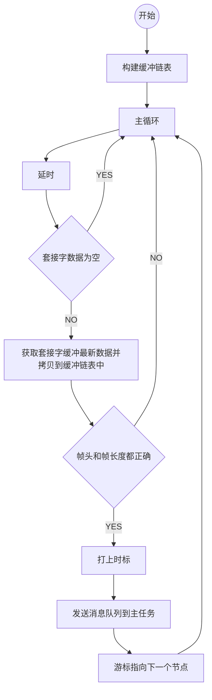
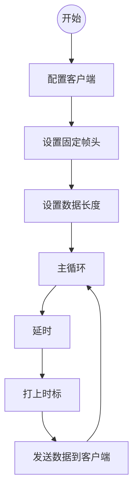

# t_udpr()

```c
void                 /* 无返回值 */
t_udpr(              /* UDP接收任务 */
        int sfd,     /* 套接字 */
        int period,  /* 任务运行周期 */
        int duration /* 以太网接收缓冲链表长度 */
)
```



# t_udpt()

```c
void                    /* 无返回值 */
t_udpt(                 /* UDP发送任务 */
        int sfd,        /* 套接字 */
        int portclient, /* 客户端接口 */
        int addrgroup,  /* 组播地址 */
        int period      /* 任务运行周期 */
)
```


